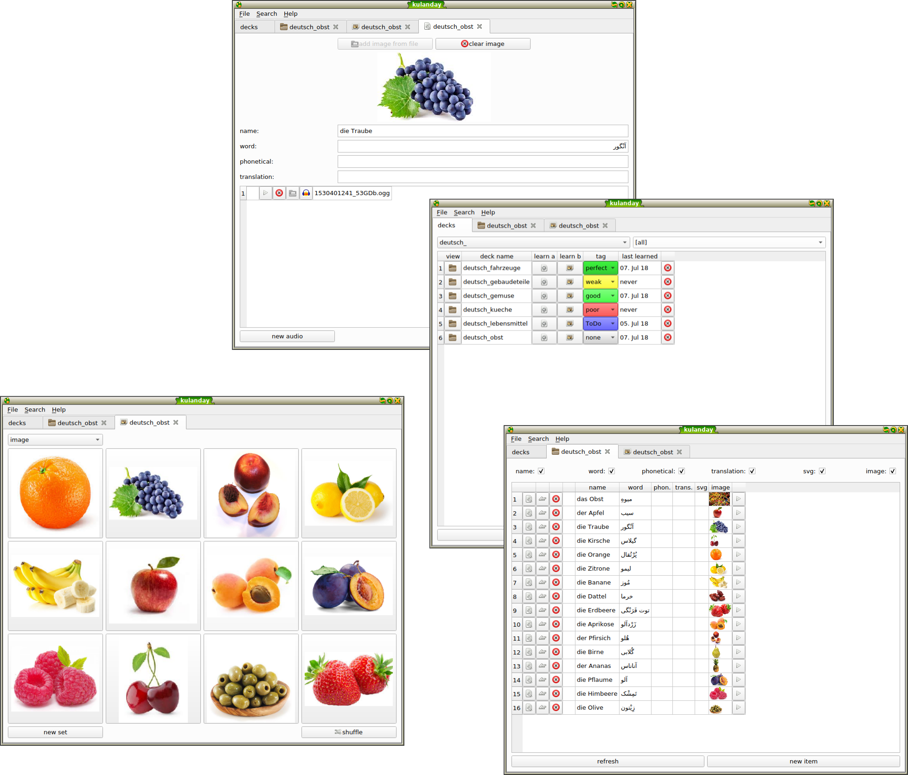

<!--
# Tambi #

[Tambi](./tambi.md) [tʰambi] is the main program for studying the bible (and much more).
-->

# Kulanday #

[Kulanday](./kulanday.md) [kʰʊlandɛᶦ] is a software for collecting words and phrases for learning languages. Its main components are an interface for creating new entries for a single word or phrase enriched with one or more audio recordings (or already existing audio-material) and an image. This data can be later used for the learning-modes and of course to be used as a dictionary or for analysing the language. 

Here you can download the latest beta for Windows:
<button type="button" onclick="location='https://github.com/tambi-soft/kulanday/releases/download/0.7.3/kulanday_0.8.0.zip'">Download beta 0.8.0</button>

On Arch-Linux there is a PKGBUILD in the Aur called "kulanday-git".

On other Operating Systems feel free to checkout the latest master and compile for yourself:
<button type="button" target="_blank" onclick="window.open('https://github.com/tambi-soft/kulanday')">checkout the sourceode</button>

## Test Decks ##
For testing Kulanday, you can checkout these decks:

<button type="button" onclick="location='http://www.mathematik.uni-marburg.de/~beckers4/kulanday_decks/deutsch_fahrzeuge.kdeck'">deutsch_fahrzeuge.kdeck</button>

<button type="button" onclick="location='http://www.mathematik.uni-marburg.de/~beckers4/kulanday_decks/deutsch_gebaudeteile.kdeck'">deutsch_gebaudeteile.kdeck</button>

<button type="button" onclick="location='http://www.mathematik.uni-marburg.de/~beckers4/kulanday_decks/deutsch_gemuese.kdeck'">deutsch_gemuese.kdeck</button>

<button type="button" onclick="location='http://www.mathematik.uni-marburg.de/~beckers4/kulanday_decks/deutsch_kueche.kdeck'">deutsch_kueche.kdeck</button>

<button type="button" onclick="location='http://www.mathematik.uni-marburg.de/~beckers4/kulanday_decks/deutsch_lebensmittel.kdeck'">deutsch_lebensmittel.kdeck</button>

<button type="button" onclick="location='http://www.mathematik.uni-marburg.de/~beckers4/kulanday_decks/deutsch_obst.kdeck'">deutsch_obst.kdeck</button>

Import these decks into Kulanday using the menu-entry: File -> Import Deck
